# Basic CI/CD

В качестве результата работы ты должен сохранить два дампа образов виртуальных машин, описанных далее. \
**P.S. Ни в коем случае не сохраняй дампы в гит!**

### Part 1. Настройка **gitlab-runner**

##### Подними виртуальную машину *Ubuntu Server 22.04 LTS*.
*Будь готов, что в конце проекта нужно будет сохранить дамп образа виртуальной машины.*

##### Скачай и установи на виртуальную машину **gitlab-runner**.

`sudo apt install gilab-runner` - не используем, так как там старая версия и не отоброжаются логи на сайте.

```bash
sudo curl -L --output /usr/local/bin/gitlab-runner "https://gitlab-runner-downloads.s3.amazonaws.com/latest/binaries/gitlab-runner-linux-amd64"
sudo chmod +x /usr/local/bin/gitlab-runner
sudo useradd --comment 'GitLab Runner' --create-home gitlab-runner --shell /bin/bash
# Optional sudo systemctl stop gitlab-runner
# Optional sudo rm /etc/systemd/system/gitlab-runner.service
sudo gitlab-runner install --user=gitlab-runner --working-directory=/home/gitlab-runner

sudo systemctl enable gitlab-runner
sudo systemctl start gitlab-runner
```

Машина должна работать в фоне, если видим ошобка `ERROR: Job failed: prepare environment: exit status 1. Check https://docs.gitlab.com/runner/shells/index.html#shell-profile-loading for more information`

Переходим в `sudo vim /home/gitlab-runner/.bash_logout` и комментируем

```
if [ "$SHLVL" = 1 ]; then
    [ -x /usr/bin/clear_console ] && /usr/bin/clear_console -q
fi
```


`sudo apt install make`
`sudo apt install gcc`

Если ssh не работает `sudo systemctl status ssh` нужно переустановить его

```bash
sudo apt remove --purge openssh-server
sudo apt install openssh-server
```

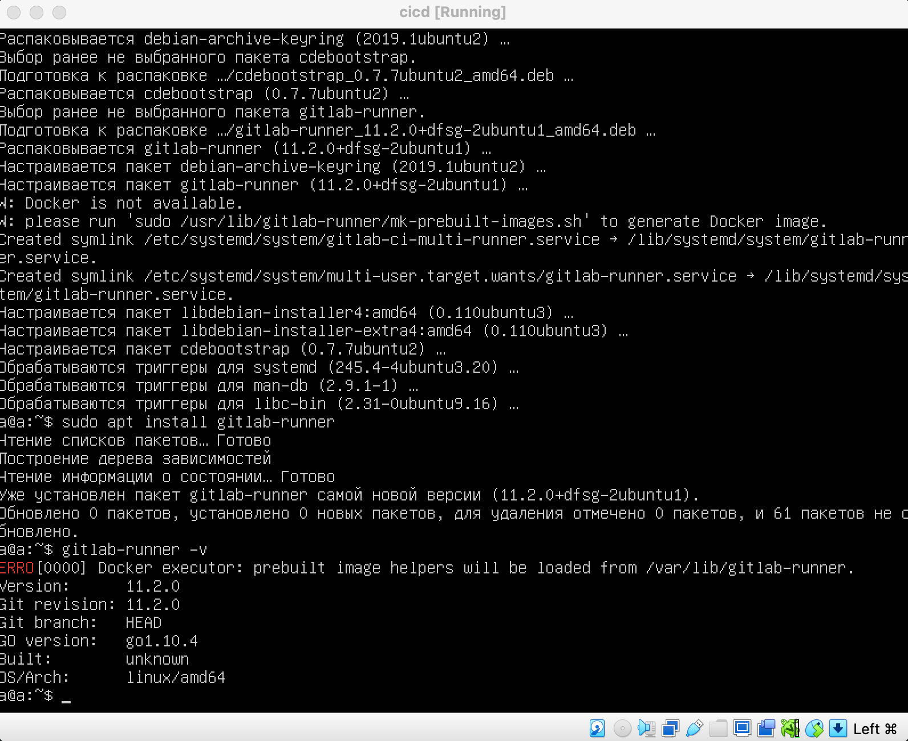

##### Запусти **gitlab-runner** и зарегистрируй его для использования в текущем проекте (*DO6_CICD*).
- Для регистрации понадобятся URL и токен, которые можно получить на страничке задания на платформе.

`sudo gitlab-runner register`

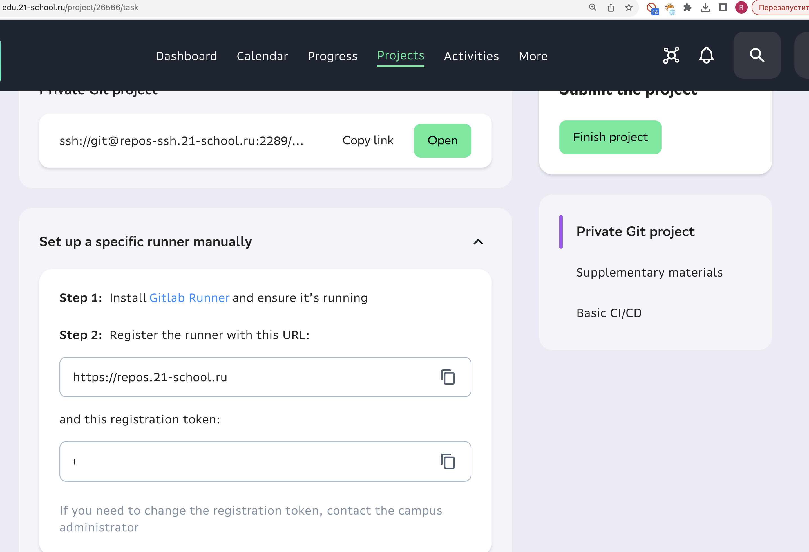

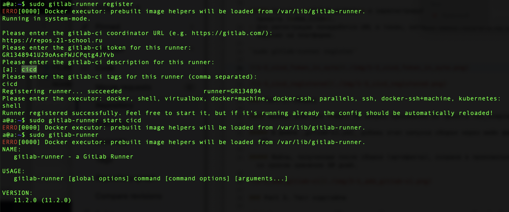

### Part 2. Сборка

Настраиваем ssh на машине

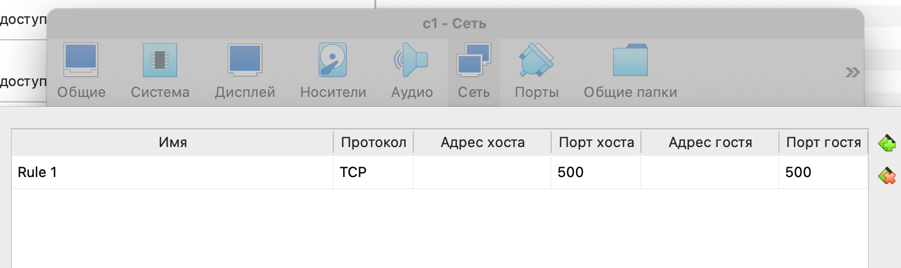

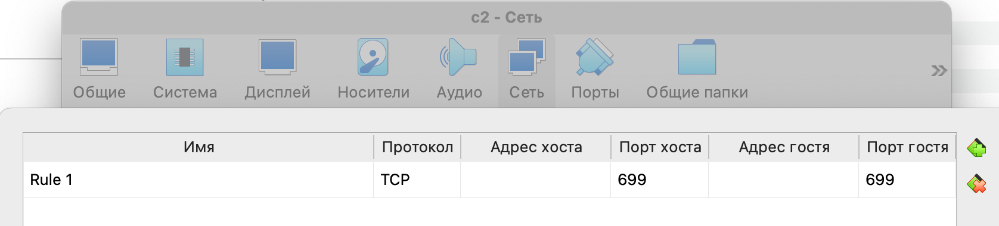

`sudo vim /etc/ssh/sshd_config`

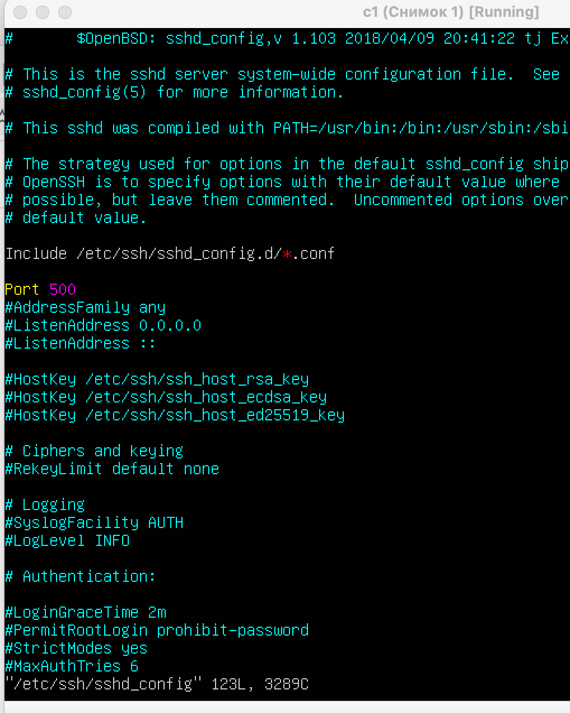

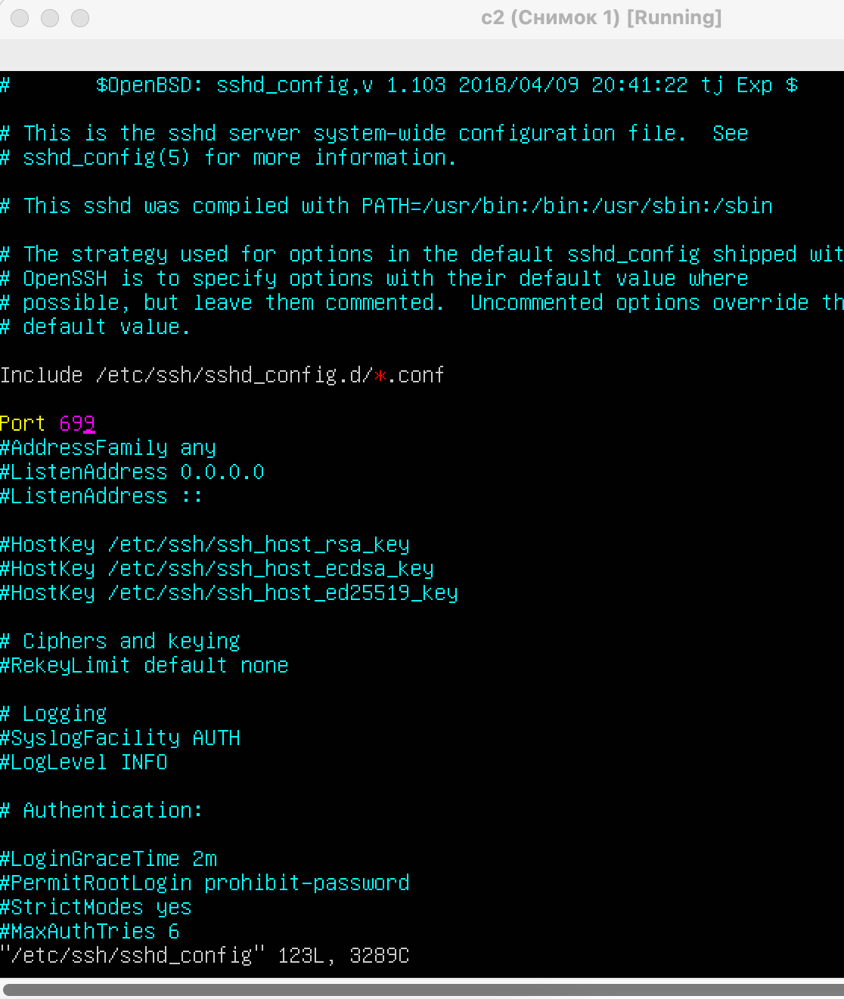

в термиале `ssh -p 699 a@localhost`

#### Напиши этап для **CI** по сборке приложений из проекта *C2_SimpleBashUtils*.

##### В файле _gitlab-ci.yml_ добавь этап запуска сборки через мейк файл из проекта _C2_.

##### Файлы, полученные после сборки (артефакты), сохрани в произвольную директорию со сроком хранения 30 дней.

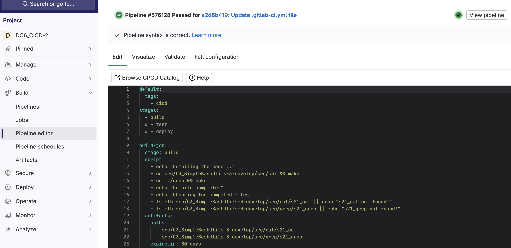

### Part 3. Тест кодстайла

`sudo apt install clang-format`

#### Напиши этап для **CI**, который запускает скрипт кодстайла (*clang-format*).

##### Если кодстайл не прошел, то «зафейли» пайплайн.

##### В пайплайне отобрази вывод утилиты *clang-format*.

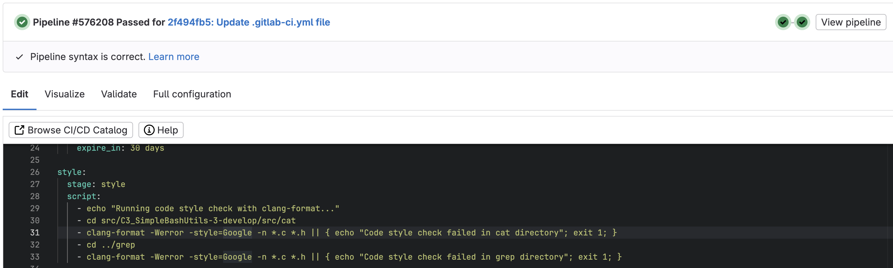

### Part 4. Интеграционные тесты

#### Напиши этап для **CI**, который запускает твои интеграционные тесты из того же проекта.

##### Запусти этот этап автоматически только при условии, если сборка и тест кодстайла прошли успешно.

##### Если тесты не прошли, то «зафейли» пайплайн.

##### В пайплайне отобрази вывод, что интеграционные тесты успешно прошли / провалились.

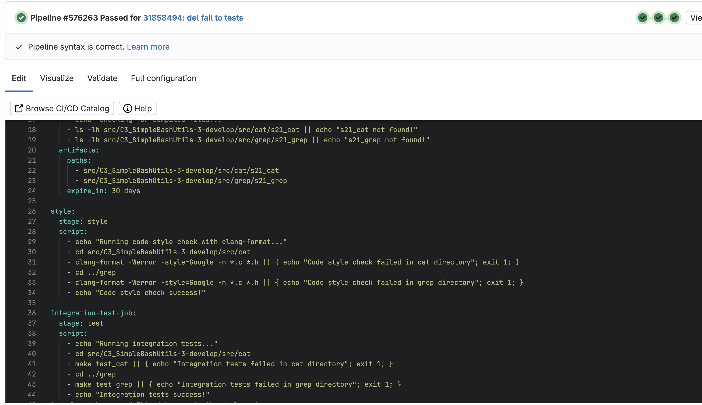

### Part 5. Этап деплоя

`-` Для завершения этого задания ты должен перенести исполняемые файлы на другую виртуальную машину, которая будет играть роль продакшна. Удачи.

**== Задание ==**

##### Подними вторую виртуальную машину *Ubuntu Server 22.04 LTS*.

#### Напиши этап для **CD**, который «разворачивает» проект на другой виртуальной машине.

создаем и заходим в gitlab-runner

`sudo su - gitlab-runner`

`ssh-keygen` -> enter - enter - enter По классике

`ssh-copy-id -p 699 q@192.168.100.10` -> вводим пароль от 2 машины

 Проверяем sshd `sudo systemctl status sshd`

Если ssh изначально не работает на машине то
```
sudo apt update
sudo apt remove --purge openssh-server
sudo apt install openssh-server
```

Аналогично настраиваем ssh как на первой машине `sudo vim /etc/ssh/sshd_config`

add ip to netplan

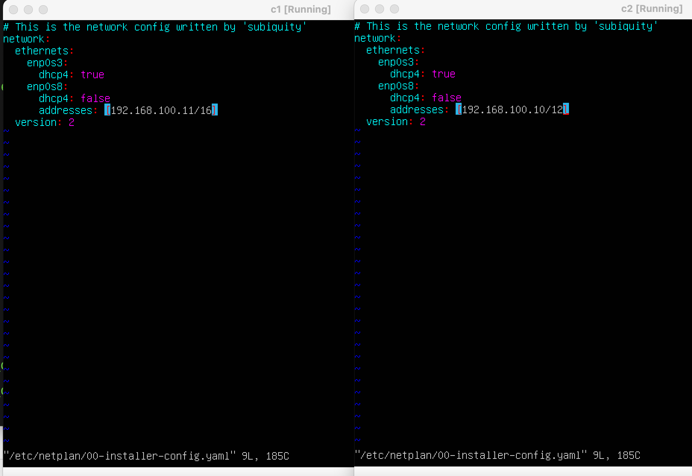

Делаем соединение между двумя машинами

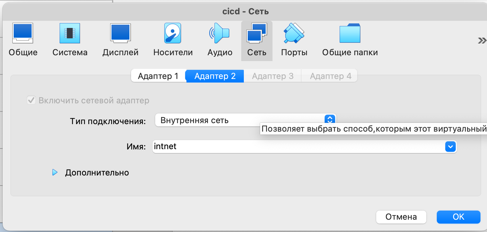

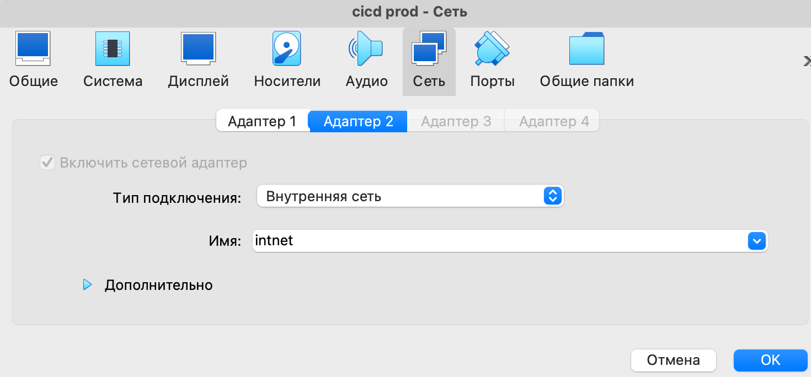


На машинах копируем ключ под пользователем gitlab-runner на 2 машину командой `ssh-copy-id -p 699 q@192.168.100.10` -> pass от 2 машины

Для удобства копирования подключаемся с мака к ssh localhost машины 1

`ssh -p 699 a@localhost`

Если ошибка

```
@@@@@@@@@@@@@@@@@@@@@@@@@@@@@@@@@@@@@@@@@@@@@@@@@@@@@@@@@@@
@    WARNING: REMOTE HOST IDENTIFICATION HAS CHANGED!     @
@@@@@@@@@@@@@@@@@@@@@@@@@@@@@@@@@@@@@@@@@@@@@@@@@@@@@@@@@@@
IT IS POSSIBLE THAT SOMEONE IS DOING SOMETHING NASTY!
```
То чистим старые данные `ssh-keygen -R "[localhost]:699"`

На 2 машине выдаем права `sudo chmod 777 /usr/local/bin/`

##### Запусти этот этап вручную при условии, что все предыдущие этапы прошли успешно.

##### Напиши bash-скрипт, который при помощи **ssh** и **scp** копирует файлы, полученные после сборки (артефакты), в директорию */usr/local/bin* второй виртуальной машины.
*Тут тебе могут помочь знания, полученные в проекте DO2_LinuxNetwork.*

- Будь готов объяснить по скрипту, как происходит перенос.

##### В файле _gitlab-ci.yml_ добавь этап запуска написанного скрипта.

##### В случае ошибки «зафейли» пайплайн.

В результате ты должен получить готовые к работе приложения из проекта *C2_SimpleBashUtils* (s21_cat и s21_grep) на второй виртуальной машине.

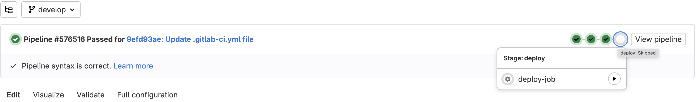

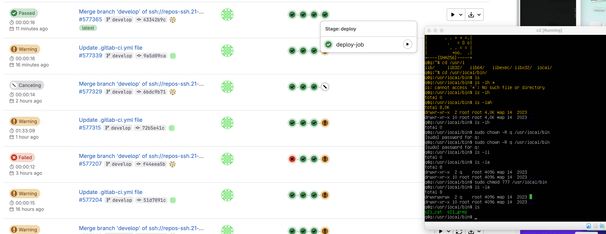

ОШибка если файл не скопировался

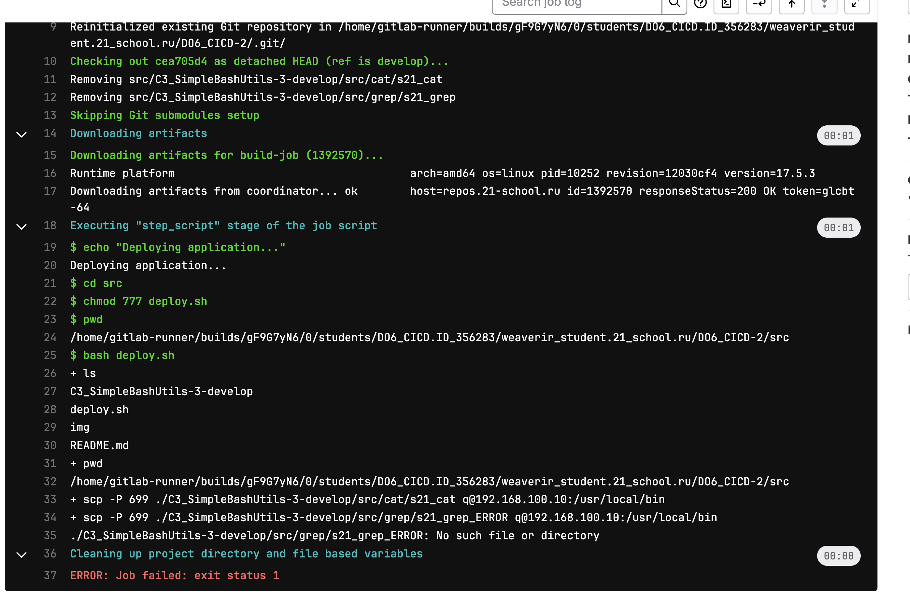


##### Сохрани дампы образов виртуальных машин.
**P.S. Ни в коем случае не сохраняй дампы в гит!**
- Не забудь запустить пайплайн с последним коммитом в репозитории.

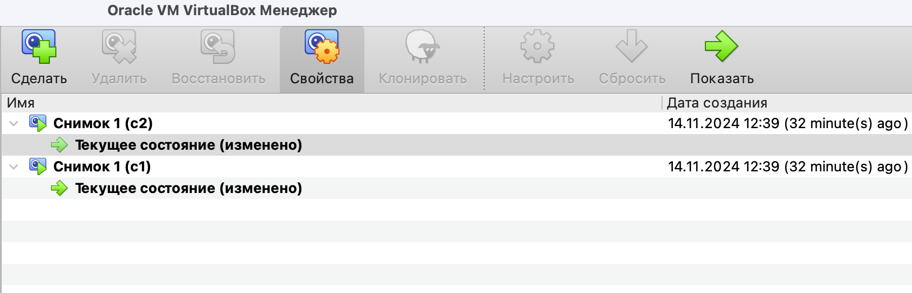


### ОПЦИАНОЛЬНО то что пробовал на других машинах

Проверка прав доступа для gitlab-runner: Убедитесь, что у gitlab-runner есть права на доступ к его домашней директории и необходимым файлам:

```
ls -ld /home/gitlab-runner
ls -l /home/gitlab-runner
```

Если доступ ограничен, предоставьте права:

```
sudo chown -R gitlab-runner:gitlab-runner /home/gitlab-runner
sudo chmod -R 700 /home/gitlab-runner
```

Создайте .bash_profile: Попробуйте создать пустой файл .bash_profile, так как его отсутствие может иногда вызывать проблемы с загрузкой профилей:
`touch /home/gitlab-runner/.bash_profile`

Проверьте настройки прав доступа: Убедитесь, что пользователь gitlab-runner имеет нужные права доступа. Проверим директорию и права на .bashrc

```
sudo chown -R gitlab-runner:gitlab-runner /home/gitlab-runner
sudo chmod 700 /home/gitlab-runner
sudo chmod 644 /home/gitlab-runner/.bashrc
```

`sudo chown -R gitlab-runner:gitlab-runner /home/a/DO6_CICD-2/` даем права gitlab-runner на внесение изменений в проекте

Перезапускаем `sudo systemctl restart gitlab-runner`


### Part 6. Дополнительно. Уведомления

`-` Здесь написано, что твое следующее задание выполняется специально для нобелевских лауреатов. Здесь не сказано, за что они получили премию, но точно не за умение работать с **gitlab-runner**.

**== Задание ==**

##### Настрой уведомления об успешном/неуспешном выполнении пайплайна через бота с именем «[твой nickname] DO6 CI/CD» в *Telegram*.

- Текст уведомления должен содержать информацию об успешности прохождения как этапа **CI**, так и этапа **CD**.
- В остальном текст уведомления может быть произвольным.


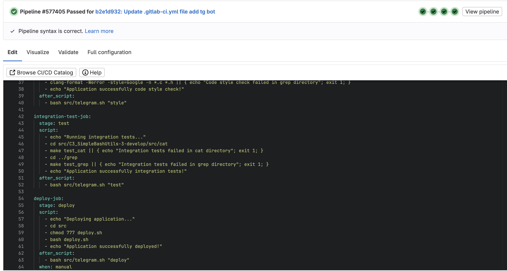

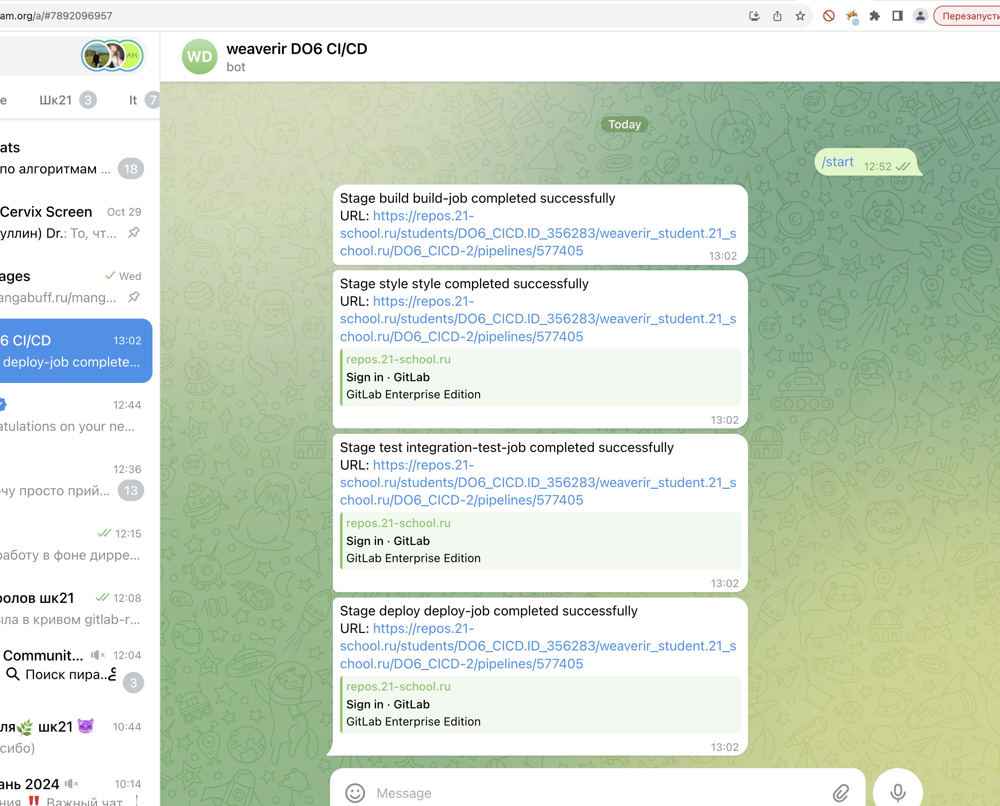
